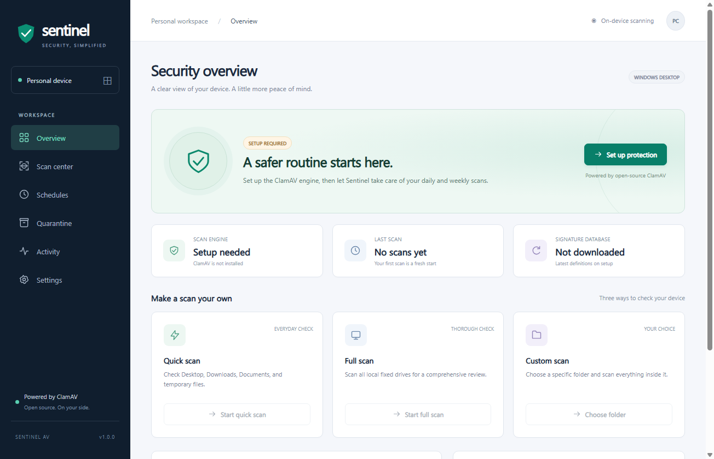

# Sentinel AV · Clam Desktop

A Windows Electron desktop companion for ClamAV. Includes a polished dashboard, first-run engine installation, hourly malware definition updates, configurable scan schedules, system tray controls, notifications, scan reports, exclusions, and manual quarantine/restore.



## Run locally

Requires Windows 10/11 and Node.js 22.12 or later.

```powershell
npm ci
npm start
```

Open **Settings → Install ClamAV & set up**. Sentinel downloads the latest official Cisco Talos Windows ZIP, verifies its published SHA-256 digest, installs it in your user profile, and runs FreshClam to download the database. The engine download is approximately 225 MB; definitions require additional space. No administrator access is required. You can also select an existing `clamscan.exe` installation.

## Build a Windows installer

```powershell
npm test
npm run dist
```

The installer is written to `release/`. It creates desktop and Start menu shortcuts. Installed copies start in the tray at Windows sign-in by default; this can be disabled in Settings. The app has a taskbar icon while open and a notification-area tray icon while running.

The build is unsigned. Public distribution should use a trusted Windows signing certificate. No certificate or signing key is included in this repository.

## Scanning and updates

- **Quick scan:** daily at 12:00 local time by default; recursively checks Desktop, Downloads, Documents, and the user's temporary folder.
- **Full scan:** Sunday at 18:00 by default; recursively checks all local fixed drives accessible to the current user.
- **Custom scan:** choose a folder with the native Windows picker.
- Change frequency, day, time, and enabled state independently for both schedules.
- Missed schedules are caught up once on the next app start/resume. Concurrent scans are prevented. Closing the window keeps the app in the tray by default.
- FreshClam checks for new definitions hourly while the app is running, with an hourly retry backoff. FreshClam handles server rate limiting and incremental database updates. The first database download is part of setup.
- Database updates and scans do not run concurrently. Scans due during an update run after it finishes.
- Exit codes, errors, permission warnings, partial results, and cancellations are reported. The UI never shows a fabricated completion percentage.

Sentinel is an **on-demand and scheduled scanner**, not a real-time file monitoring driver, firewall, or registered Windows Security antivirus provider. It does not disable Microsoft Defender. Scans cannot run while the computer is off or Sentinel is completely quit. ClamAV's default file-size and archive limits apply; “full scan” means all accessible local fixed drives, not guaranteed inspection of every byte.

## Quarantine and privacy

Detections are reported first. Quarantine requires an explicit action and confirmation, moves a regular file into the app's data directory under a non-executable extension, and stores its original path. Restore asks for confirmation and never overwrites an existing file. Quarantine is storage isolation, not an encrypted or access-controlled sandbox. There is no automatic destructive deletion.

Settings, the engine, signatures, quarantine, and up to 200 scan reports live in `%APPDATA%/sentinel-av` (the exact directory is displayed in exclusions). Plain-text scan logs are retained in its `logs` subfolder. Logs contain local file paths. No telemetry or file uploads are implemented; network traffic is limited to official engine downloads and ClamAV definition services. The application data folder is automatically excluded from scans.

## Development and verification

`npm test` checks scheduling, input validation, scan output parsing, exclusion handling, and trusted engine asset selection. `npm run pack` builds an unpacked app. For an Electron render smoke test, create `test-output/` and run `npx electron . --smoke-test`; a screenshot and renderer state are written there. Smoke tests use a temporary profile and do not register startup or run background scans.

The renderer is sandboxed with context isolation and a restrictive CSP. Privileged operations stay in the main process behind a sender-validated IPC bridge. Processes are spawned with argument arrays, not shell-interpolated file paths. The app never accepts an executable path directly from renderer text.

ClamAV is a separate project, distributed under its own licenses. Engine downloads preserve upstream license files. Sentinel is not affiliated with Cisco or the ClamAV team.

References: [ClamAV scanning](https://docs.clamav.net/manual/Usage/Scanning.html), [signature updates](https://docs.clamav.net/manual/Usage/SignatureManagement.html), [official engine releases](https://github.com/Cisco-Talos/clamav/releases), [Electron security](https://www.electronjs.org/docs/latest/tutorial/security).
